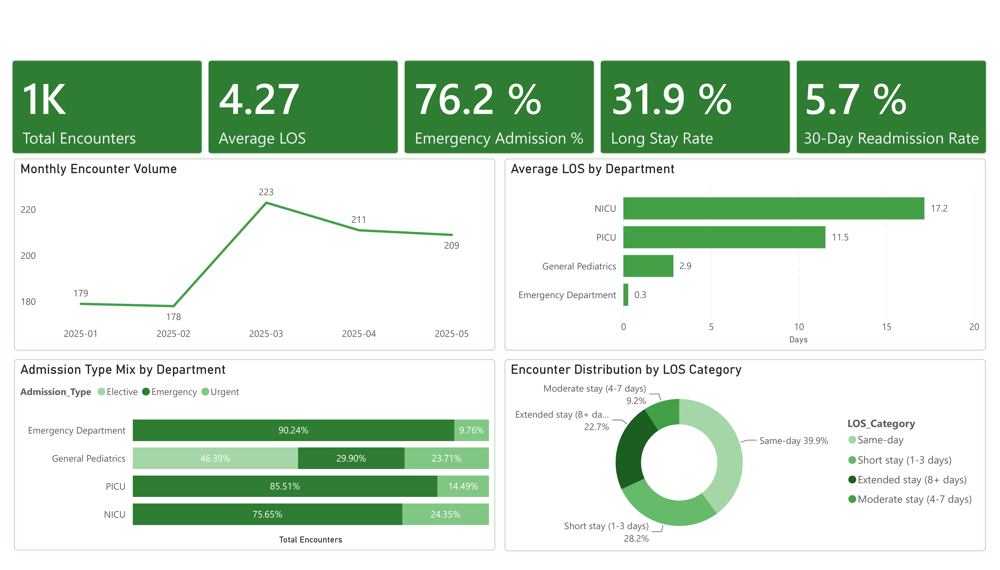
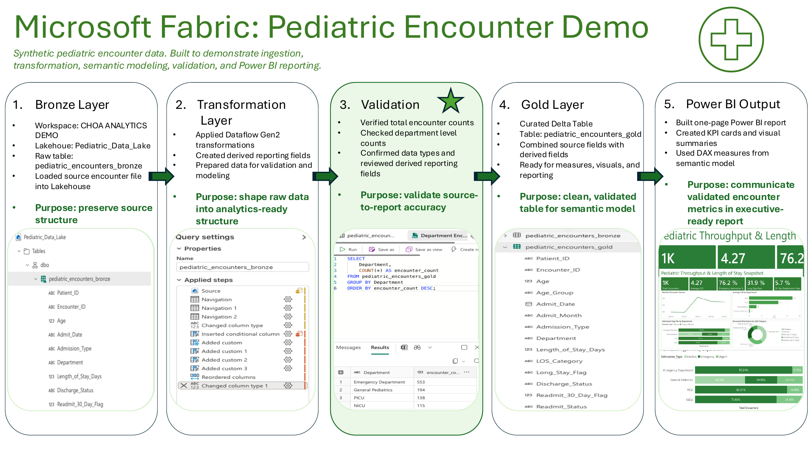

# Pediatric Hospital Throughput Analytics Demo



**Microsoft Fabric | Power BI | Dataflow Gen2 | Lakehouse | Healthcare Operations Analytics**

## Project Overview

This project demonstrates an end-to-end healthcare analytics workflow using synthetic pediatric encounter data. The goal was to show how raw encounter-level data can be ingested, transformed, validated, modeled, and presented in a Power BI report for operational decision-making.

The dataset contains **1,000 synthetic pediatric encounters** from 2025 and was designed to simulate common provider-side analytics questions related to encounter volume, length of stay, admission type, discharge status, and 30-day readmissions.

> **Data note:** This project uses synthetic data only. It does not contain patient-identifiable information, real hospital records, protected health information, or proprietary data from any healthcare organization.

## Business Problem

Hospital leadership needs a reliable view of pediatric encounter throughput to understand:

- Which departments have the highest encounter volume
- Which departments have the longest average length of stay
- How admission types vary across departments
- What percentage of encounters result in 30-day readmission
- How discharge status and length-of-stay patterns differ by department

The project demonstrates how an analyst can convert raw encounter data into a curated reporting layer, semantic model, and executive-facing Power BI dashboard.

## Executive Snapshot

| Metric | Value |
|---|---:|
| Total Encounters | 1,000 |
| Average LOS | 4.27 days |
| Emergency Admission % | 76.2% |
| Long Stay Rate | 31.9% |
| 30-Day Readmission Rate | 5.7% |

## Tools Used

- **Microsoft Fabric** - Lakehouse workflow environment
- **Dataflow Gen2** - data cleaning and transformation
- **Power BI** - semantic model, DAX measures, and report development
- **CSV / Excel** - synthetic source data
- **SQL / Data Modeling Concepts** - validation logic, curated reporting design, and source-to-report checks

## Dataset

The source dataset is encounter-level and includes:

| Field | Description |
|---|---|
| Patient_ID | Synthetic patient identifier |
| Encounter_ID | Unique synthetic encounter identifier |
| Age | Patient age |
| Admit_Date | Encounter admission date |
| Admission_Type | Elective, emergency, or urgent admission |
| Department | Emergency Department, NICU, PICU, or General Pediatrics |
| Length_of_Stay_Days | Encounter length of stay in days |
| Discharge_Status | Discharged home, transferred, or observation/follow-up |
| Readmit_30_Day_Flag | Indicator for 30-day readmission |

## Analytics Workflow



The project follows a simplified lakehouse workflow:

```text
Raw CSV Source
   ↓
Fabric Lakehouse / Bronze Table
   ↓
Dataflow Gen2 Transformations / Silver Table
   ↓
Curated Reporting Table / Gold Table
   ↓
Power BI Semantic Model
   ↓
Executive Dashboard
```

## Data Transformations

Key transformations included:

- Loaded raw encounter data into a Bronze table to preserve source structure
- Created patient age groups: Infant, Child, and Adolescent
- Standardized admission type and department categories
- Mapped discharge status values into reporting-friendly groups
- Created encounter month from admission date
- Created length-of-stay categories: Same-day, Short stay, Moderate stay, and Extended stay
- Created long-stay and 30-day readmission flags for KPI reporting
- Validated row counts, department counts, data types, and derived fields before reporting

## Data Modeling and Measures

The reporting layer was designed around a curated encounter table, `pediatric_encounters_gold`, with source fields and derived reporting fields. The Power BI semantic model supported the following measures:

- Total Encounters
- Average Length of Stay
- Emergency Admission Percentage
- Long Stay Rate
- 30-Day Readmission Rate
- Encounter Volume by Department and Month
- Average LOS by Department
- Admission Type Mix by Department
- Encounter Distribution by LOS Category

Example DAX measures are included in [`docs/dax_measures.md`](docs/dax_measures.md).

## Key Findings from the Demo Dataset

- Emergency Department encounters represented the largest department volume.
- The dataset had an overall average length of stay of **4.27 days**.
- Emergency admissions accounted for **76.2%** of encounters.
- Long stays of 4 or more days accounted for **31.9%** of encounters.
- The 30-day readmission rate was **5.7%**.
- NICU and PICU had the highest average length of stay, while the Emergency Department had the lowest average LOS.

## Repository Structure

```text
pediatric-throughput-analytics/
|
|-- README.md
|-- data/
|   |-- pediatric_encounters_bronze.csv
|   |-- pediatric_encounters_gold.csv
|-- screenshots/
|   |-- fabric_workflow_demo.png
|   |-- power_bi_report.png
|-- docs/
|   |-- dax_measures.md
|   |-- data_dictionary.md
|   |-- validation_summary.md
|   |-- project_summary.pdf
|   |-- fabric_workflow_demo.pdf
|   |-- power_bi_report_export.pdf
|-- scripts/
|   |-- generate_gold_table.py
|   |-- validate_encounters.py
```

## How to Review This Project

1. Review the workflow diagram to understand the data pipeline.
2. Open the Power BI report screenshot to view the executive dashboard.
3. Review the data dictionary and transformation logic.
4. Review the DAX measures used for KPI reporting.
5. Review the validation summary to understand how source-to-report accuracy was checked.

## Limitations

- The dataset is synthetic and limited to 1,000 rows.
- Results are intended for workflow demonstration, not clinical decision-making.
- The project focuses on data transformation, validation, semantic modeling, and dashboard design rather than predictive modeling.

## About

This project was created as part of a healthcare analytics portfolio to demonstrate Microsoft Fabric, Power BI, Dataflow Gen2, data transformation, semantic modeling, validation, and healthcare operations reporting skills.
